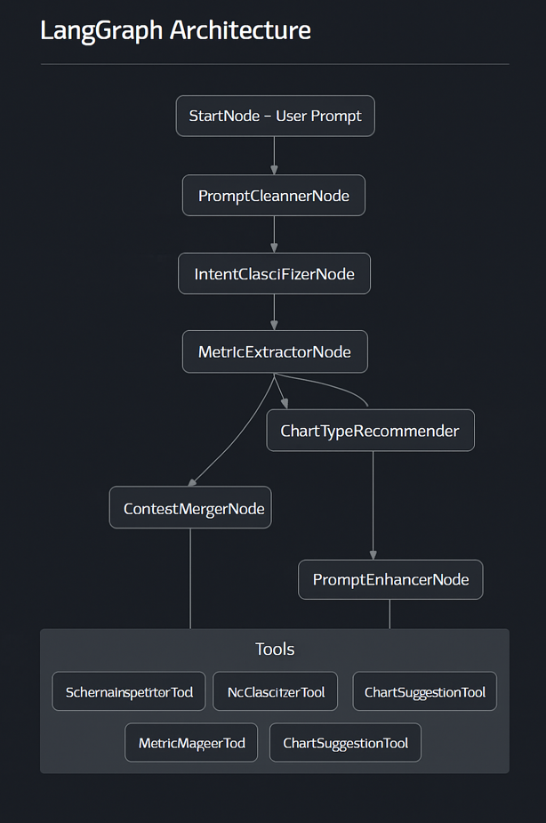

# intent-resolver-langgraph-agent

# 🧠 Intent Resolver Agent

## 🌟 Problem Statement

Users often input vague or ambiguous natural language queries such as “Show me sales” or “Compare this year’s performance.” Without properly resolving intent, downstream agents (like SQL generators or chart builders) can misinterpret or produce invalid outputs.

This agent bridges the gap between human language and structured data operations by interpreting, refining, and structuring user queries in the context of available schema and past interactions.

---

## 💡 Agent Objective

- Detect and interpret user intent from natural language prompts.
- Recommend chart types and identify metrics/dimensions.
- Enhance prompt using schema and past query context.
- Output structured query intent for downstream agents (e.g., Query Generator, Chart Config Agent).

---

## 📂 Scope of Agent

### ✅ The Agent WILL:
- Parse and classify query type (comparison, trend, summary, etc.).
- Suggest appropriate chart type (bar, line, pie, etc.).
- Extract **metric(s)** and **dimension(s)** (e.g., revenue by month).
- Merge previous context (e.g., "now show product-wise").
- Enhance prompt with relevant metadata.
- Output a structured object for downstream agents.

### ❌ The Agent WILL NOT:
- Generate SQL queries directly.
- Execute data retrieval operations.
- Render or configure chart UI.
- Validate or fetch schema (delegated to Schema Agent).
- Handle multi-dataset merging.

---

## ⚙️ LangGraph Architecture



### 🔄 States

| State Name            | Purpose                                            |
|-----------------------|----------------------------------------------------|
| `IntentContext`       | Holds parsed intent structure, chart type, etc.    |
| `UserPrompt`          | Stores current natural language query              |
| `SchemaContext`       | Injected schema info from previous agent           |
| `SessionContext`      | Previous prompt history and follow-up references   |

---

### 🧩 Nodes

| Node Name              | Functionality                                        |
|------------------------|-----------------------------------------------------|
| `StartNode`            | Accepts user prompt and schema                      |
| `PromptCleanerNode`    | Removes filler/stopwords                            |
| `IntentClassifierNode` | Classifies query (compare, trend, summary, etc.)    |
| `MetricExtractorNode`  | Identifies key metrics (e.g., revenue, count)       |
| `DimensionDetectorNode`| Detects grouping dimension (e.g., date, product)    |
| `ChartTypeRecommender` | Suggests chart type based on intent + schema        |
| `ContextMergerNode`    | Merges with prior query context if applicable       |
| `PromptEnhancerNode`   | Finalizes structured query output                   |
| `OutputNode`           | Sends enriched prompt to next agent                 |

---

## 🛠️ Tools Required

| Tool Name                | Purpose                                               |
|--------------------------|-------------------------------------------------------|
| `SchemaInspectorTool`    | Checks schema to validate fields                     |
| `NLClassifierTool`       | Classifies sentence intent using LLM or keywords     |
| `MetricMapperTool`       | Maps natural language metrics to schema fields       |
| `ChartSuggestionTool`    | Suggests chart type (line, bar, pie) based on pattern|

---

## 📊 Core Logic (Analytics Functions)

### Intent Classification
- Trend → "Show sales over time"
- Comparison → "Compare revenue by product"
- Summary → "What’s the average sales?"

### Metric Extraction
- Keywords like *sales, revenue, profit* matched to schema
- Mapped via synonym tables + schema info

### Dimension Detection
- Time-based → suggest "line chart"
- Category-based → suggest "bar chart"
- Single-value metric → suggest "card or pie chart"

### Chart Suggestion Logic
| Intent Type  | Metric Type | Dimension Type | Suggested Chart |
|--------------|-------------|----------------|------------------|
| Trend        | Numeric     | Date/Time      | Line Chart       |
| Comparison   | Numeric     | Categorical    | Bar Chart        |
| Distribution | Numeric     | None           | Histogram        |

---

## 🧑‍💼 Agent Persona & Tone

| Attribute            | Description                                       |
|----------------------|---------------------------------------------------|
| Persona              | Data analyst assistant with sharp domain skills   |
| Tone                 | Concise, contextual, and user-guiding             |
| Contextual Awareness | Learns previous query structures and history      |
| Proactivity          | Suggests fields when query is incomplete          |

### Tone Examples

- 🟢 **Clarified Prompt**: “Do you mean total revenue grouped by month?”
- 🟡 **Suggestion**: “For comparing products, a bar chart works best.”
- 🔴 **Fallback**: “Couldn’t detect a metric. Try specifying ‘sales’ or ‘revenue.’”

---

## 📏 Output (Structured Object for Downstream Agent)

```json
{
  "intent_type": "trend",
  "metric": "revenue",
  "dimension": "month",
  "chart_type": "line",
  "schema_validated": true,
  "context_merged": true,
  "raw_prompt": "show revenue by month",
  "enhanced_prompt": "Display total revenue grouped by month in a line chart"
}
